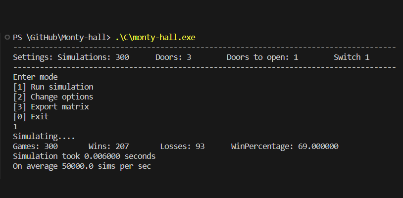
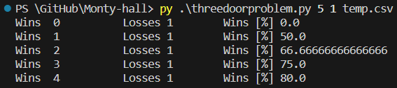

# Monty hall
Simulate the Monty Hall Problem, known for its counterintuitive nature:

Picture yourself on a gameshow stage with three doors. Behind two of these doors lurk goats, while the remaining door hides a tempting $1,000,000 prize. The host instructs you to select one of the doors, and whatever is concealed behind it becomes yours.

Once you make your choice, the host proceeds to open one of the two unchosen doors, revealing a goat. At this point, you face a pivotal decision: will you remain steadfast with your original selection or opt to switch to the other unopened door?

## C
In the folder `./C/`, you can find a simulation of this problem a compiled program and a results file.

Running `.\C\monty-hall.exe` presents you with a menu where you can change the settings and see how it affects the probability of you winning. The C/executable also allows you to change the number of doors at the beginning. You you choose to switch, you alternate between being shown a door and switching util you have the only door that is closed. 

You can also change how often you want to print how many games you have won so far, and you can run a preset of simulations with 3-9 doors with the gamehost showing 0-7 doors, both with you swiching at every chance, and you not switching.

## Python
Running `py ./threedoorprobem.py <number of simulations> <switch door?> <output_file_name>` lets you simulate the gameshow and lets you check for yourself if it is an advantage to switch doors or not.

Running `py ./monty-hall-animated.py` simulates you playing the game many times and switching doors every time. A graph is shown showing you hoe many percent of the games so far you have won.